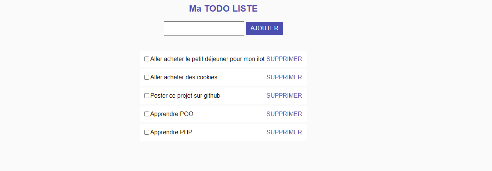

# :page_with_curl: To-Do List App en Programmation Objet #

## Description ##

Cette petite application en php permet à l'utilisateur de gérer une liste de tâches qu'il souhaite effectuer. L'utilisateur peut ajouter autant de tâches qu'il souhaite, cocher les tâches comme complétées ou bien encore supprimer celle(s) accomplie(s).
Il s'agit bel et bien de la todo list mais cette fois ci en mode programmation objet.

### Fonctionnalités ###

- Ajout : L'utilisateur peut saisir une tâche qu'il souhaite accomplir et l'ajouter à la liste en appuyant sur le bouton "AJOUTER".
- Marquage : L'utilisateur peut cliquer sur une case à cocher à côté de chaque tâche. La tâce est considéré comme complété et la ligne sera donc barré.
- Suppression : L'utilisateur peut supprimer s'il le souahte une tâche barré ou non, en cliquant sur le bouton "SUPPRIMER" à côté de la tâche adéquate.

#### Structure du Projet ####

Le projet est organisé comme suit :

- `index.php` : Fichier principal de l'application.
- `database.class` : Classe de gestion de la connexion à la base de données. Assure la connexion à la base de données MySQL et fournit une instance de connexion utilisée par la classe TaskManager.
- `taskManager.class` : Classe de gestion des tâches de la ToDo list. Contient des méthodes pour ajouter, supprimer, mettre à jour et récupérer des tâches depuis la base de données. Utilise la connexion à la base de données fournie par la classe.
- `css/styles.css` : Fichier CSS pour le style de l'application.
- `img` : Favicon + Capture d'écran

###### Technologies Utilisées ######


## Installation

1. Clonez le dépôt :

```bash
git clone https://github.com/chr1stopherperez/ToDo_List_POO.git
cd ToDo_List_POO

```

## Captures d'écran

<p align="center">
  
  
</p>